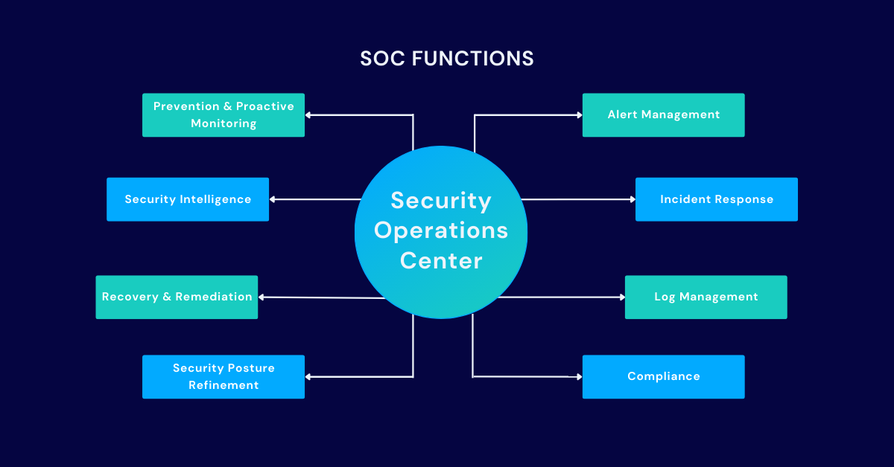
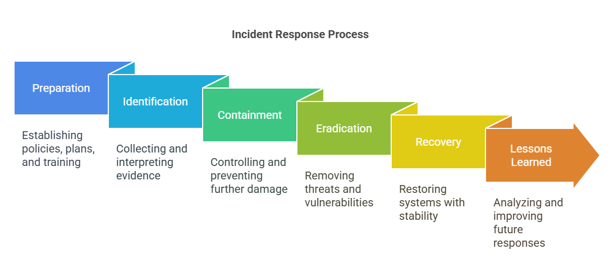

# 🔐 Incident Response in a Security Operations Center (SOC)

## Introduction

Today most organizations use computers, networks, cloud services, and web applications to run their business. Because of this, cyberattacks are also increasing. Hackers try to steal data, damage systems, or stop services by using attacks such as **malware, phishing, ransomware, and brute-force attacks**.

To protect systems from these threats, organizations use a **Security Operations Center (SOC)**. A SOC is a team of cybersecurity professionals who monitor networks and systems **24/7** to detect and respond to security threats.

One of the most important responsibilities of a SOC team is **Incident Response**. Incident Response is the process of detecting, investigating, and handling cybersecurity incidents quickly and effectively.

A good incident response process helps organizations **reduce damage, recover faster, and improve their security systems**.

---

## Security Operations Center Workflow

*Figure 1: Security Operations Center workflow showing monitoring, detection, analysis, and response to security threats.*

---

## What is Incident Response?

Incident Response is a **structured process used to handle cybersecurity incidents**. A security incident can include:

- Unauthorized access to systems  
- Malware infections  
- Phishing attacks  
- Data breaches  
- Denial-of-Service (DoS) attacks  

The main goal of incident response is to **identify the attack, stop it, remove the threat, and restore normal operations**.

Most organizations follow a standard **Incident Response Lifecycle**, which includes six stages.

---

## Incident Response Lifecycle

*Figure 2: Incident Response Lifecycle followed by SOC teams to manage cybersecurity incidents.*

---

### 1. Preparation

Preparation is the first and most important stage. In this stage, organizations prepare themselves to handle possible cyber incidents.

Activities in this stage include:

- Creating an **Incident Response Plan**
- Training SOC analysts
- Installing security monitoring tools
- Creating backup and recovery plans

Some commonly used SOC tools are:

- **SIEM (Security Information and Event Management)**
- **Endpoint Detection and Response (EDR)**
- **Intrusion Detection Systems (IDS)**

Good preparation helps organizations respond quickly when an attack happens.

---

### 2. Detection and Analysis

In this stage, SOC analysts monitor network activities and system logs to detect suspicious behavior.

Security tools generate alerts when unusual activities are detected. SOC analysts then analyze these alerts to determine whether they are real threats.

Example:  
If multiple login attempts are made from an unknown IP address, it may indicate a **brute-force attack**.

Early detection helps prevent attackers from causing serious damage.

---

### 3. Containment

After confirming a security incident, the SOC team works to **stop the attack from spreading**.

Examples of containment actions include:

- Disconnecting infected devices from the network
- Blocking malicious IP addresses
- Disabling compromised accounts
- Isolating affected systems

Containment helps control the attack before it spreads across the entire network.

---

### 4. Eradication

In this phase, the SOC team removes the **root cause of the attack**.

Activities may include:

- Deleting malware or malicious files
- Fixing vulnerabilities
- Installing security patches
- Changing compromised passwords

The main goal is to **completely remove the attacker’s access from the system**.

---

### 5. Recovery

Once the threat is removed, systems are restored and brought back to normal operation.

Recovery steps may include:

- Restoring data from backups
- Reconnecting systems to the network
- Monitoring systems for unusual activity

This stage ensures that business operations can continue safely.

---

### 6. Post-Incident Review

After the incident is resolved, the SOC team analyzes the entire event.

They study:

- How the attack happened
- How it was detected
- How it was handled

This helps improve future security strategies and prevent similar attacks.

---

## Real-Life Example of Incident Response

A well-known cyberattack called the **WannaCry ransomware attack (2017)** affected thousands of organizations worldwide. The ransomware encrypted files and demanded money to unlock them.

Organizations with a strong incident response plan quickly:

- Isolated infected computers
- Stopped the ransomware from spreading
- Restored systems using backups

This shows how important incident response is for **minimizing cyberattack damage**.

---

## Importance of Incident Response

### 1. Reduces Damage
Quick response helps prevent attackers from causing serious harm.

### 2. Protects Sensitive Data
Incident response helps protect important company and customer information.

### 3. Improves Security
By analyzing incidents, organizations can improve their security systems.

### 4. Maintains Business Operations
Proper response ensures that business services continue without major interruptions.

### 5. Builds Trust
Strong cybersecurity practices increase customer trust in an organization.

---

## Conclusion

Cyberattacks are becoming more common and more advanced. Organizations must be prepared to detect and respond to these attacks quickly.

Incident Response is a critical process in a **Security Operations Center**. By following the incident response lifecycle — **Preparation, Detection, Containment, Eradication, Recovery, and Review** — organizations can effectively manage cybersecurity incidents.

Continuous monitoring, proper security tools, and trained SOC analysts help organizations maintain strong cybersecurity and protect their digital assets.

---

## Author

**Siddharth Arwade**  
Course: *Security Operations Center – Tools & Techniques*  
Platform: *Infosys Springboard*
