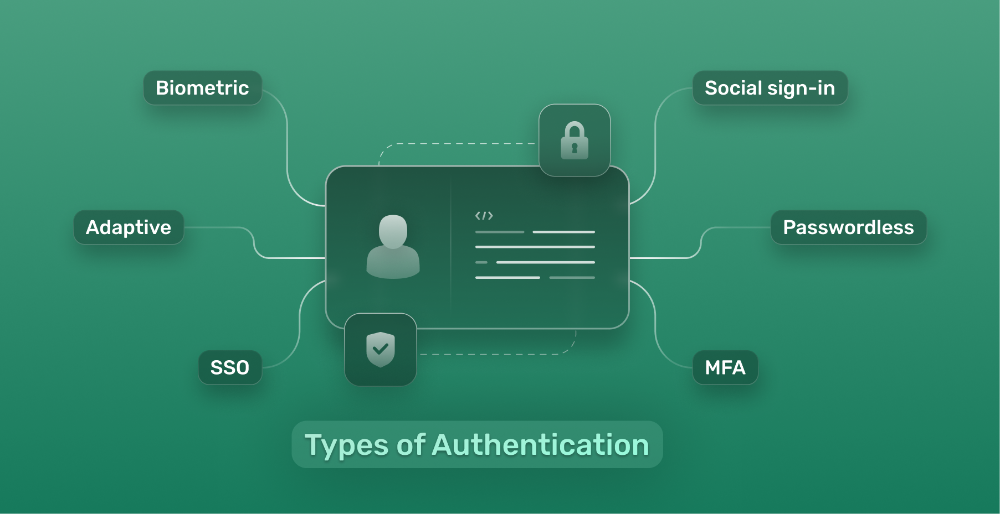
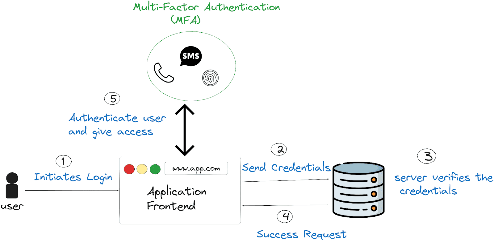

# 🔐 Authentication in Cybersecurity

## Introduction

In today's digital world, organizations rely heavily on computers, networks, cloud platforms, and web applications to run their operations. Employees access company systems remotely, customers use online services, and sensitive information is stored digitally. Because of this growing digital environment, protecting systems from unauthorized access has become extremely important.

Cybercriminals often try to gain access to systems by stealing passwords, exploiting vulnerabilities, or tricking users through phishing attacks. If attackers successfully gain access, they can steal confidential data, disrupt services, or cause financial losses.

To prevent unauthorized access, organizations use **authentication mechanisms**. Authentication is a key concept in cybersecurity that ensures only verified users or systems can access protected resources.

Authentication works as the **first line of defense** in protecting sensitive data and systems. It helps confirm that the person trying to access a system is truly who they claim to be.

This article explains authentication, different authentication factors, multi-factor authentication, and the importance of authentication in cybersecurity.

---

## What is Authentication?

Authentication is the process of **verifying the identity of a user, device, or system** before granting access to resources.

When users log into a system such as email, banking, or a company network, they must provide credentials like a **username and password**. The system checks these credentials against stored data. If the credentials match, the user is granted access. If they do not match, the system denies access.

Authentication is often confused with **authorization**, but they serve different purposes.

- **Authentication** verifies the identity of the user.
- **Authorization** determines what resources the user can access after authentication.

For example, when an employee logs into a company network, authentication confirms the employee’s identity. Authorization then determines whether the employee can access files, applications, or administrative tools.

Authentication is critical for protecting sensitive systems such as financial platforms, healthcare databases, corporate networks, and government systems.

---

## Authentication Factors

Authentication methods are generally classified into three categories called **authentication factors**. These factors represent different ways of verifying identity.

### 1. Something You Know

This refers to information that the user knows.

Examples include:

- Passwords
- PIN numbers
- Security questions

Passwords are the most common authentication method. However, weak passwords can easily be guessed or stolen by attackers.

---

### 2. Something You Have

This refers to a physical device that the user possesses.

Examples include:

- One-Time Password (OTP) tokens
- Smart cards
- Mobile authentication apps
- Hardware security keys

For example, many systems send an OTP to a user's mobile phone during login for verification.

---

### 3. Something You Are

This refers to biometric characteristics that are unique to a person.

Examples include:

- Fingerprint recognition
- Facial recognition
- Iris scanning
- Voice recognition

Biometric authentication is becoming more common because it provides stronger identity verification.

---

## Authentication Factors Diagram

*Figure 1: The three authentication factors used to verify user identity.*

---

## Multi-Factor Authentication (MFA)

Passwords alone are not always secure because attackers can steal them using phishing attacks, malware, or data breaches. To improve security, organizations use **Multi-Factor Authentication (MFA)**.

Multi-Factor Authentication requires users to provide **two or more authentication factors** before gaining access to a system.

For example:

1. The user enters a **password**
2. The system sends an **OTP to the user's phone**
3. The user enters the OTP to complete login

Even if an attacker knows the password, they cannot access the system without the second authentication factor.

Common MFA combinations include:

- Password + OTP
- Password + fingerprint
- Password + authentication app
- Smart card + PIN

MFA significantly improves security and is widely used in banking systems, corporate networks, cloud services, and government platforms.

---

## Multi-Factor Authentication Workflow

*Figure 2: Multi-Factor Authentication process requiring multiple verification steps before granting access.*

---

## Importance of Authentication in Cybersecurity

Authentication is a critical component of cybersecurity because it protects systems from unauthorized access.

### Prevents Unauthorized Access

Authentication ensures that only verified users can access systems and data.

### Protects Sensitive Information

Organizations store important data such as financial records, personal information, and intellectual property. Authentication helps protect this information from attackers.

### Strengthens Security Systems

Strong authentication methods help organizations improve their overall cybersecurity posture.

### Maintains Accountability

Authentication systems help track user activities within systems, making it easier to monitor and investigate suspicious behavior.

### Reduces Cybersecurity Risks

Using strong authentication methods significantly reduces the chances of cyberattacks and data breaches.

---

## Authentication Best Practices

Organizations follow several best practices to maintain strong authentication security.

### Use Strong Passwords

Passwords should be long, complex, and unique. Users should avoid using the same password across multiple platforms.

### Enable Multi-Factor Authentication

MFA should be enabled wherever possible to provide an additional layer of security.

### Implement Account Lockout Policies

Accounts should temporarily lock after multiple failed login attempts to prevent brute-force attacks.

### Use Secure Authentication Protocols

Technologies such as OAuth, SAML, and Kerberos help provide secure authentication systems.

### Educate Users About Security

Training users to identify phishing attempts and social engineering attacks helps reduce authentication risks.

---

## Conclusion

Authentication is one of the most important components of cybersecurity. It ensures that only authorized users or systems can access protected resources.

As cyber threats continue to evolve, traditional password-based authentication alone is no longer enough. Organizations must adopt stronger authentication methods such as **Multi-Factor Authentication and biometric verification**.

By implementing strong authentication systems, following security best practices, and continuously improving security technologies, organizations can effectively protect their digital assets and reduce the risk of cyberattacks.

Authentication not only protects systems but also helps build trust between organizations and their users in the digital world.

---

## Author

**Siddharth Arwade**  
Course: *CompTIA Cybersecurity Analyst+ (CySA+) – Authentication*  
Platform: *Infosys Springboard*
